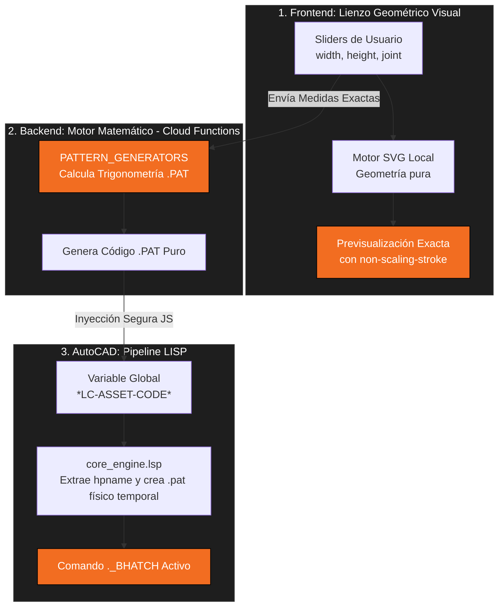

# 📠LispCentral Hatch Engine: Pautas Arquitectónicas y Matemáticas

Este documento recopila las lecciones críticas, reglas geométricas y estándares de programación desarrollados durante la creación del motor paramétrico de patrones `.pat` y renderizado SVG.

> [!IMPORTANT]
> Todo nuevo patrón (arquetipo) que se agregue al sistema (dentro de la carpeta `web/src/components/tools/patterns/`) debe cumplir rigurosamente con estas reglas para garantizar que lo que el usuario ve en la pantalla sea **exactamente** lo que se exporta hacia AutoCAD.

## 0. Mapa Arquitectónico del Motor (Tubería Completa)

**Atención:** La arquitectura ya no es monolítica. `HatchEngine.js` funciona únicamente como un índice. Los arquetipos viven de forma modular en múltiples archivos separados dentro de `patterns/`.

Este diagrama representa el flujo de datos desde los sliders interactivos en el navegador hasta que el puntero de AutoCAD dispara el sombreado.
Asegúrate de respetar este paradigma: **El Frontend dibuja geometría visual pura, y el Backend calcula la trigonometría del `.pat`**.



---

## 1. El Puente Matemático: SVG vs PAT

La principal causa de errores visuales y desfases es entender de forma equivocada cómo dibujan la web y AutoCAD.

### ðŸ•¸ï¸ SVG (Renderizado Web)
- **Paradigma**: Geometría finita y explícita.
- **Lógica**: Dibuja **segmentos de línea** con un punto de inicio `(X1, Y1)` y un punto final `(X2, Y2)`.
- **Comportamiento**: Un patrón se logra dibujando la "Célula Base" dentro de un bounding box, y la etiqueta `<pattern>` de SVG se encarga de teselar esa caja una y otra vez en mosaico ortogonal.

### ðŸ—ï¸ AutoCAD (.PAT)
- **Paradigma**: Vectores de propagación infinita.
- **Lógica**: Dibuja **líneas infinitas**. A partir de un Origen `(X, Y)` y un Ãngulo `A`, la línea viaja infinitamente.
- **Comportamiento**: Los patrones se forman porque esa línea infinita se fragmenta (trazos visibles e invisibles) y la familia de líneas entera se clona desplazándola perpendicularmente (`DeltaY`) y paralelamente (`DeltaX`).

### âš–ï¸ La Regla de Oro
**NUNCA se deben usar SVGs estáticos pre-diseñados (imágenes externas) como la fuente principal en backgrounds CSS (`background-image`).** El CSS repite estas imágenes usando `preserveAspectRatio="meet"`, lo que destruye el teselado, provoca gaps (márgenes transparentes gigantes) y genera borrosidad masiva por el remuestreo de trazos finos (`non-scaling-stroke` falla en backgrounds).

> [!WARNING]
> **Norma de Visualización de Ãconos Estáticos (Catálogos y Fallbacks):**
> Cuando se deban renderizar tarjetas de catálogo de arquetipos (o fallbacks de arquetipos sin motor matemático) utilizando sus íconos `.svg` estáticos:
> 1. **Bypass Matemático:** En vistas de catálogo o grillas, se debe ignorar el motor `SvgPreviewEngine` y utilizar etiquetas `` nativas, para respetar exactamente el diseño estético del `.svg` original.
> 2. **Grilla y Object Fit:** Los íconos deben mostrarse en una grilla nativa CSS (ej. `grid-template-columns: repeat(2, 1fr)`). Las imágenes DEBEN tener `object-fit: cover` con `width: 100%; height: 100%` dentro de un contenedor con `overflow: hidden`.
> 3. **Recorte en lugar de deformación:** La regla "Lo que sobre sobra" (`cover`) garantiza que la relación de aspecto del SVG no se deforme (a diferencia de `fill`), mientras inunda perfectamente el contenedor.
> 4. **Grosor de Líneas Inalterable:** Debido a que el SVG utiliza internamente `vector-effect="non-scaling-stroke"`, usar `cover` asegura que el navegador escale la imagen pero los trazos se mantengan SIEMPRE finos (generalmente de su stroke original), sin engordar ni deformarse al estirar la ventana.

> [!CAUTION]
> **Peligro: Colisión de IDs Globales en SVG React**
> Si varias instancias de `SvgPreviewEngine` (el motor matemático) se renderizan en una misma página, la etiqueta `<pattern id="...">` NO puede tener un ID estático (ej. `id="hatchPattern"`). 
> Los IDs en SVG son globales en el DOM. Si hay colisión, el navegador aplicará el diseño del primer `<pattern>` encontrado a TODOS los rectángulos de la página. 
> **Regla:** Siempre inyectar un identificador único en el motor: `<pattern id={\`hatchPattern-\${archetype.id}\`}>`.

Para lograr la verdadera parametrización, todo arquetipo **debe** tarde o temprano tener su función `generateSvgRenderer(params)` que use *las mismas variables matemáticas* que `generatePat(...)` para dibujar las etiquetas `<line>` directamente en un `<svg>`.

---

## 2. Geometría y Teselado Perfecto

Para que el archivo `.pat` de AutoCAD cierre perfectamente y no genere serruchos o roturas entre las columnas:

- **Ãngulos Trigonométricos Estrictos:** El ángulo de una línea inclinada a menudo no puede ser arbitrario si queremos que repita en bloque. En patrones como el Chevron, el Ãngulo se deriva estrictamente de las dimensiones: `angle = atan(Height / Width)`.
- **Cálculo de Desfase (DeltaX, DeltaY):**
  Cuando una línea inclinada forma parte de una columna y se repite verticalmente, el desplazamiento global en el `.pat` (`dX`, `dY`) se calcula proyectando la distancia vertical de repetición (`th`) sobre el vector de la línea:
  ```javascript
  const dX = th * sin(angleRad);
  const dY = th * cos(angleRad);
  ```
- **Unión sin Juntas:** Si un patrón requiere que las piezas se toquen sin separación (Joint = 0), las líneas verticales redundantes se pueden ignorar siempre y cuando los vértices de las diagonales se unan exactamente en las mismas coordenadas.

---

## 3. Lógica de Interfaz y "Reality Checks"

La interfaz debe forzar restricciones geométricas del mundo real para evitar generar archivos `.pat` matemáticamente imposibles o visualmente amorfos.

> [!TIP]
> **Relaciones Mínimas:** En `HatchGenerator.jsx`, usa los `useEffect` para limitar los inputs del usuario.
> Ejemplo: Para el Chevron, la tabla física no puede ser más ancha que larga. Por lo tanto, se debe forzar la regla `Width >= Height`. Si el usuario ingresa un ancho diminuto, el script debe autocorregirlo al valor del alto.

---

## 4. Historial de Desarrollo (Log de Conquistas)

### ¿Qué hemos logrado hasta ahora?
1. **Motor de Previsualización Matemática Paramétrica (`SvgPreviewEngine.jsx`):**
   - Eliminamos la dependencia de SVG estáticos distorsionados. 
   - Desarrollamos la lógica para que la previsualización lea las fórmulas matemáticas puras en tiempo real. 
   - Resolvimos el problema de **gaps (huecos)** y **borrosidad** aislando las imágenes en grillas CSS puras con `transform: scale()` para recortar el padding, y utilizando renderizado matemático donde está disponible.
   - El selector de patrones (Modal) y el panel de colección ahora muestran mallas en alta definición perfectamente ensambladas.

2. **Matemáticas Complejas Dominadas en `HatchEngine.js`:**
   - **Chevron:** Logramos calcular la trigonometría inversa (`Math.atan`) para que los ángulos se ajusten dinámicamente al largo y ancho ingresado por el usuario, sin que las líneas se desfasen.
   - **Herringbone (Espina de Pez):** Se descifró la matemática de teselado a 45 grados. Construimos un bucle matemático que simula el comportamiento de AutoCAD para dibujar segmentos de la espina de pez de cualquier tamaño, dentro de una matriz ortogonal SVG sin deformarse.

3. **Estandarización y Limpieza de Base de Datos (Firestore):**
   - El usuario tenía **196 hachuras** con nombres, categorías e íconos dispares heredados del sistema viejo.
   - Creamos un **Analizador Heurístico** que lee el código fuente `.pat` en el lado del servidor, extrae los ángulos y segmentos matemáticos, y los clasifica automáticamente.
   - Logramos unificar más del **50% del catálogo (95 hachuras)** con precisión absoluta en un solo clic, estandarizando sus categorías y reasignándoles SVGs matemáticos.
   - Dejamos el resto (67 orgánicos/complejos) en una cuarentena controlada (`needsReview: true`) listos para el pulido final.

4. **Mejora UX/UI (Hatch Generator):**
   - Se añadió un sistema de "Grid Layout" para la vista en vivo, permitiendo cambiar dinámicamente cuántas repeticiones (ej. 1x1, 3x3) se ven en pantalla, facilitando el trabajo de depuración y la vista previa del cliente.
   - Controles dinámicos: el panel lateral adapta sus campos ("Joint", "Spacing", "Rows") dependiendo de las necesidades matemáticas exclusivas de cada arquetipo seleccionado.

---

## 5. Plan a Largo Plazo: Integración Modular de Arquetipos

El objetivo final de este proyecto es migrar y parametrizar matemáticamente **todos** los arquetipos de patrones estáticos a módulos independientes en `web/src/components/tools/patterns/`.

### ðŸ› ï¸ Flujo de Trabajo para Agregar un Nuevo Arquetipo

Como **Desarrollador o Agente Junior**, sigue rigurosamente estos pasos por CADA nuevo patrón que abordes:

1. **Seleccionar el Patrón:**
   Identifica la célula base geométrica y las dimensiones físicas.
2. **Backend (La Matemática del PAT):**
   La lógica trigonométrica para desplazar líneas en AutoCAD (DeltaX, DeltaY) ahora se gestiona **exclusivamente en las Cloud Functions** de Firebase (`buildHatchPattern`). El Frontend NO debe calcular ni generar cadenas `.pat`.
3. **Frontend: Programar `generateSvgRenderer(params)`:**
   **MANDATORIO:** Debes usar geometría SVG nativa pura (`<line>`, `<path>`) calculada en base a los parámetros visuales (ej. `w`, `h`, `j`). 
   **REGLA CRÍTICA:** ESTÁ ESTRICTAMENTE PROHIBIDO generar cadenas `.pat` en el cliente para luego parsearlas con utilidades como `generateSvgPathsFromPat`. El Frontend dibuja el SVG visual en la rejilla; el Backend se encarga del PAT matemático.
4. **Validación:**
   Usa el "Modo Célula Base" (Rows: 1, Cols: 1) para confirmar visualmente que el SVGRenderer cierra perfecto. Exporta el `.pat` a AutoCAD y verifica a escala. NUNCA procedas sin validar ambas vías.


## 6. Actualizaciones y Resoluciones de Bugs (Junio 2026)

### Logros y Soluciones de Bugs Recientes

#### Interfaz de Usuario (UI/UX)
Se implementaron estrictamente las normas de diseño del proyecto:
*   **Navegación por Breadcrumbs:** Reemplazo del botón flotante por una navegación en la parte superior (Library / Archetypes / Settings).
*   **Filtros Clásicos:** Eliminación de los "Pills" de búsqueda a favor de un `<input>` de texto limpio y un menú desplegable `<select>` nativo para Categorías.
*   **Estandarización de Idioma:** Labels en inglés (sin quemado de strings mixtos).
*   **Diseño de Controles (Builder):**
    *   El **Visualizador SVG** interactivo ha sido anclado firmemente en la parte superior.
    *   Ancho máximo de 350px a los controles de parámetros.
    *   Los botones de acción (Apply to AutoCAD y Favorite) anclados en la base.

#### Lógica Matemática y Backend (Cloud Functions)
*   **Diagnóstico de Bug Crítico (Solid Fills en AutoCAD):** Se detectó y resolvió el problema por el cual AutoCAD mostraba los patrones generados como un relleno sólido (SOLID).
*   **Corrección del Estándar PAT:** El generador de la nube inyectaba la *Altura Total* (\totalH) en el parámetro de desplazamiento horizontal (delta-y) para las líneas verticales (Ángulo 90). Se reescribió la lógica matricial en `\functions/patterns/index.js` para corregir `\13_running_bond`, `\14_running_bond`, `\double_stretcher`, `\triple_stretcher`, `\common`, `\monk_bond`, `\silesian_bond`, `\flemish`, `\double_flemish`, `\triple_flemish`, `\gothic_bond`, y `\english_cross_bond`.

#### Resolución de la Inserción de Recursos y Bridge en AutoCAD
*   **Bypass de URLs SVG Relativas (`file://`):**
    Las URLs de arquetipos `/patterns/*.svg` fallaban al renderizarse dentro del browser interno de AutoCAD (WebView2/Chromium) porque este corre de manera local (`file:///...LC_Resource.html`) y resolvía los paths relativos hacia `file:///C:/patterns/*`.
    **Solución:** Se exportó la constante `ASSETS_BASE_URL = 'https://lispcentral.web.app'` desde `HatchEngine.js` y se reconstruyeron las URLs absolutas para la carga y fetch del SVG en `ThumbnailPreview.jsx`, `SvgPreviewEngine.jsx` y `HatchGenerator.jsx`.
*   **CORS en Firebase Hosting:**
    Para que el fetch de los SVGs a la URL de producción no fuese bloqueado por CORS desde el origin local `file://`, se añadieron headers de CORS (`Access-Control-Allow-Origin: *`) en `firebase.json` bajo la regla `/patterns/**`.
*   **Solución al Rechazo de HPNAME (Mismatch de Nombre):**
    El generador de la nube (Generator) escribe el PAT con su cabecera matemática real (ej. `*Herringbone_50x260_J0`). Si el LISP intentaba establecer `setvar "HPNAME" "HERRINGBONE_50"`, AutoCAD rechazaba el patrón porque no existía un patrón con ese nombre exacto dentro del archivo `.pat` temporal.
    **Solución:** Se modificó `core_engine.lsp` para que, si el archivo PAT inicia con `*`, extraiga automáticamente el nombre del patrón definido tras el asterisco (ej. `Herringbone_50x260_J0`) y lo use para `HPNAME`.
*   **Fix en `vl-catch-all-apply` y Active Search Path:**
    *   Se corrigió el uso de `vl-catch-all-apply` en `core_engine.lsp` proporcionando `'()` como segundo argumento obligatorio. Sin esto, la función lambda fallaba silenciosamente y nunca agregaba la carpeta temporal `\%TEMP%\LC_Assets` a las rutas de AutoCAD.
    *   Se reemplazó el obsoleto `setenv "ACAD"` (que requiere reiniciar el software) por `vla-put-SupportPath` vía el objeto `Preferences.Files.SupportPath` de Visual LISP, lo que actualiza el path de soporte de AutoCAD inmediatamente en caliente.
*   **Solución al Timeout de Despliegue de Functions:**
    El timeout del CLI de Firebase (`Timeout after 10000. Cannot determine backend specification`) en Windows debido a la carga pesada de `firebase-admin` se solucionó mediante el despliegue selectivo por funciones: `firebase deploy --only functions:getRoutine`.
*   **Automatización de Build y Sincronización:**
    Se implementó el plugin `syncToDistPlugin` en `vite.resource-palette.config.mjs` que copia de forma automática el HTML generado en `web/public/palette-builds/` a `web/dist/palette-builds/` usando `import.meta.url` para resolver directorios de forma portable.
